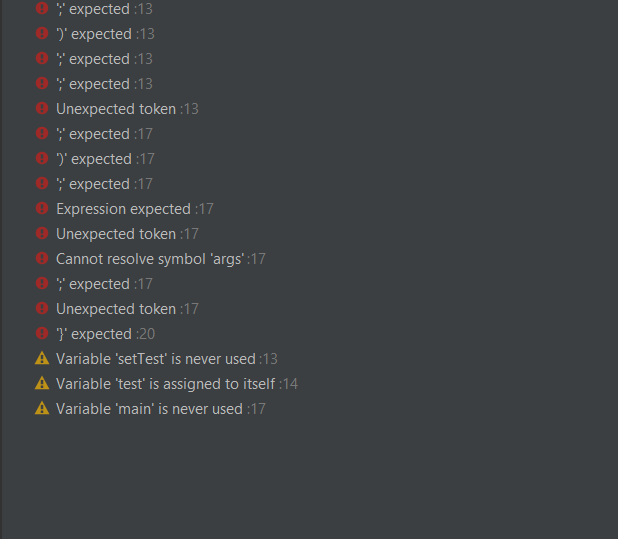

# todo-IDE

    1.Undo-Redo
     - Undo:CTRL+Z
     - Redo:Ctrl+Shift+Z
   2.Find:Crtl+F
   
   
   
   3.Replace:Ctrl+D
   
   
   
   4.Snippets de génération de code
   
     - Formulaire de création d'un fichier
     
   
    
   
    
   5.Géneration
   
   
 
    - Génerer le constructeur
     
   
   
   
   
    - Generer le getters et setters
    
   
   
   6.Contrôle de version et comparaison de fichiers
   
    -Historique local avec intellij
    
   
   
   
   
  7.Intégration de Git dans Intellij
  
   
   
   
   
  8.Comparaison de fichiers dans intellij
  
   
   
  9.Coloration et validation syntaxique
  
   - warning and errors
  
   
   
   
   
   
   
   - Quick fixes
   
   
   
   
  
  10. Auto-complition
  
   
   
   
   
  11. Formatage du texte:Fila > Settings > Editor
  
   
   
   
   
  12.Refactoring
    
   
   
   
   
   
   
  13.Analyse et Navigation
  
    -intellij Type Hiarchy et navigation pane
  
   
   
   
   
    -
  
   
  
  
   
  
   
     
    
    
   
  
 

      
